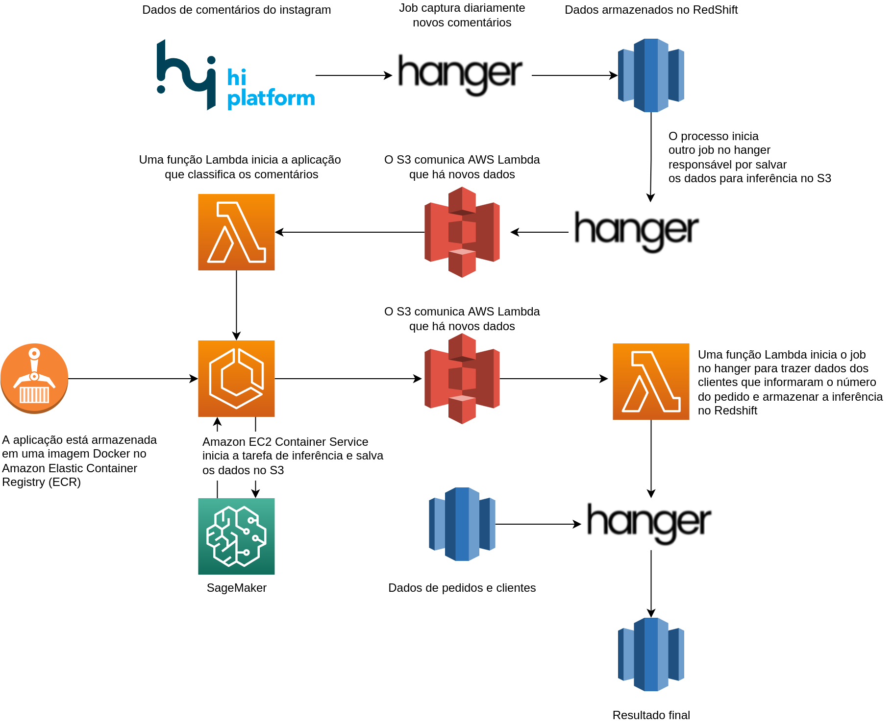
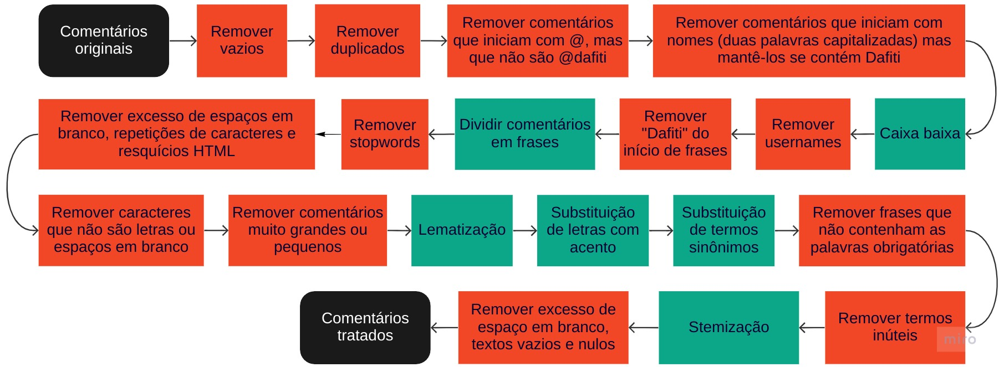

# Inferência automática de assunto em comentários na página do Instagram (@Loja)

Criado e mantido por Daniel Marostica

## Arquivos

- [Repositório](https://us-east-1.console.aws.amazon.com/codesuite/codecommit/repositories/cx_social_comments_Loja_br_instagram/browse?region=us-east-1) do código fonte
- [Hanger Job](http://142.98.11.037:8080/hanger/job/view/3210) com toda a ETL
- [Dados para inferência](https://s3.console.aws.amazon.com/s3/object/sagemaker-us-east-1-273573475387?region=us-east-1&prefix=social-media-cx-monitor/Loja_br/comentarios_instagram/data_for_inference.csv) atualizados pela ETL
- [Lambda Run Container](https://us-east-1.console.aws.amazon.com/lambda/home?region=us-east-1#/functions/cx_social_comments_Loja_br_instagram-inference-container)
- [Lambda Upload Final Results](https://us-east-1.console.aws.amazon.com/lambda/home?region=us-east-1#/functions/cx_social_comments_Loja_br_instagram-upload-redshift)
- [ECR Docker Image](https://us-east-1.console.aws.amazon.com/ecr/repositories/private/273573475387/cx_social_comments_Loja_br_instagram?region=us-east-1), onde está a imagem da aplicação
- [Task Definition](https://us-east-1.console.aws.amazon.com/ecs/home?region=us-east-1#/taskDefinitions/cx_social_comments_Loja_br_instagram) onde está configurado o container e o executável `inference.py`.

## Modelo

### Word2Vec + KMeans

Frases de comentários são transformadas em vetores (soma vetorial de cada palavra vetorizada dividida pelo tamanho da frase) e clusterizadas com KMeans. Os 100+ clusters são então atribuídos manualmente a labels no arquivo `config.py` de acordo com seus bigramas mais frequentes.

Após a classificação das frases, é atribuída uma só label ao comentário com as seguintes regras:

1. A moda das labels das frases do comentário.
2. Se não houver moda, o número de elementos no cluster: o cluster mais numeroso prevalece caso haja mais de um.

Também é atribuída uma categoria de acordo com o resultado das regras acima. Da menos para a mais importante: elogio, reclamação, problema.

Exemplo: *"Nunca tive problema coma a Loja. Quero meu dinheiro de volta! Não entregaram meu produto*". Neste caso temos um elogio, uma reclamação e um problema. A classificação do comentário será relativa ao problema: _Meu produto não chegou_.

Em `config.py` há também uma atribuição manual de "_assunto_" para as labels, para reduzir o nível de detalhe.

Para fins de análise, é desejável que cada usuário esteja relacionado a apenas 1 problema. Sendo assim, a cada execução, atualizamos os valores da coluna `moda_30d` para constar, para cada usuário do instagram, apenas o _assunto_ mais frequente nos seus comentários dos 30 dias antes da execução.

## Aplicação

- O aplicativo é compilado como imagem Docker
- Os comandos essenciais para compilar e subir a imagem no Amazon ECR estão no arquivo `docker_commands.txt`

A pasta da aplicação definida na Dockerfile é /app



### Módulos

- config.py: atribuição manual de clusters de acordo com o output do k-means. Ao fim da inferência, são exibidos no terminal termos que não possuem atribuição. Adicioná-los ao arquivo, se adequados.
- cleaner.py: limpeza e tratamento de dados utilizada em todas as etapas.
- GensimEstimator.py: SKLearn wrapper para utilizar Word2Vec em pipelines.

||
|:--:| 
|*Fluxo de limpeza de dados*| 

### Extras

- inference_sequential.py: arquivo para gerar um csv simulando inferência diária para atualização sequencial dos valores de `moda_30d`. Requer um csv com os dados para inferência no período e pode ser subido na pasta `weekly-outputs` no S3 para ativar o job do Hanger que subira para o Redshift, substituindo valores de mesma data, usuário e texto que já estejam lá.

### Execução
Esta aplicação realiza duas tarefas ativadas pelo ETL do HiPlatform para o Redshift Spectrum: treino e inferência.

**Inferência**

- O trigger é a ELT que traz os dados da HiPlatform para o Redshift Spectrum. Quando este job é finalizado no Hanger, outro realiza uma query e entrega um csv com os dados dos últimos 7 dias no S3. A atualização deste [arquivo](s3://sagemaker-us-east-1-273573475387/social-media-cx-monitor/Loja_br/comentarios_instagram/data_for_inference.csv) faz com que uma função AWS Lambda inicie o container desta aplicação.
- O processo é realizado em uma instância gerenciada pelo Fargate;
- ECS Task Definition: Definição da tarefa que será iniciada pelo Lambda para subir o container e executar a inferência.
- Imagem docker: imagem com as dependências utilizadas para executar o código
- Resultado da inferência: [S3](https://s3.console.aws.amazon.com/s3/buckets/sagemaker-us-east-1-273573475387?region=us-east-1&prefix=social-media-cx-monitor/Loja_br/comentarios_instagram/weekly-outputs/&showversions=false)
- Após a finalização da inferência, o arquivo salvo no S3 ativará uma função lambda que iniciará o processo do Hanger responsável por atualizar os dados no Redshift. Ao final, o csv da inferência é apagado. Observação: a função lambda requer uma VPC configurada com security group para acessar o hanger.

**Treino**

- O treino deve ser realizado localmente quando for necessário (por exemplo, para adicionar os novos termos exibidos no terminal da inferência), com as instruções de `docker_commands.txt`.
- O primeiro passo é [clonar](https://docs.aws.amazon.com/pt_br/codecommit/latest/userguide/setting-up-https-unixes.html) o repositório do código fonte;
- Compilar a imagem utilizando `docker build` e rodar utilizando `docker run`;
- É necessário atualizar as chaves de acesso temporárias.
- Subir os dados de treino em `s3://sagemaker-us-east-1-29602509508/social-media-cx-monitor/comentarios_instagram/data.csv`.

O treino pode ser realizado sem a imagem Docker caso as dependências estejam todas instaladas no computador.

## Dados de treino

```
SELECT
   date_trunc('day', CAST(created_at AS TIMESTAMP)) AS interaction_date,
   json_extract_path_text(social_media, 'user_name') AS user_name,
   url,
   text 
FROM
   spc_raw_hi_Loja_br.interactions i 
WHERE
   LOWER(user_name) <> 'Loja' 
   AND json_extract_path_text(social_media, 'key') = 'instagram_user'     -- comentários instagram
   AND created_at >= '2021-01-01'
```

## Observações

- A tarefa iniciada pelo Lambda possui pré-definições ([task definitions](https://console.aws.amazon.com/ecs/home?region=us-east-1#/taskDefinitions/social-media-cx-monitor-inference/status/ACTIVE)), onde configura-se o container utilizado, o poder computacional e abre-se a porta 5000 TCP.
